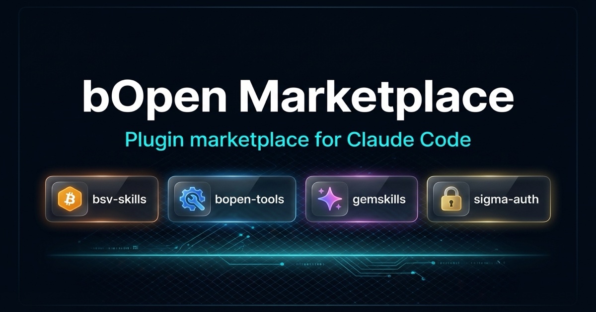

# bOpen Marketplace

Plugin marketplace for Claude Code. BSV blockchain operations, AI tools, marketing, compliance, and developer utilities.

## Installation

Add this marketplace to Claude Code:

```bash
/plugin marketplace add b-open-io/claude-plugins
```

Then install any plugin:

```bash
/plugin install <plugin-name>@b-open-io
```

## Plugins

| Plugin | Description | Install |
|--------|-------------|---------|
| [bsv-skills](#bsv-skills) | Skills for BSV wallets, identity, transactions, and standards | `/plugin install bsv-skills@b-open-io` |
| [1sat-skills](#1sat-skills) | 1Sat Ordinals minting, media extraction, marketplace | `/plugin install 1sat-skills@b-open-io` |
| [bopen-tools](#bopen-tools) | Agents, skills, and hooks for development workflows | `/plugin install bopen-tools@b-open-io` |
| [gemskills](#gemskills) | Gemini AI image generation, analysis, editing | `/plugin install gemskills@b-open-io` |
| [sigma-auth](#sigma-auth) | Bitcoin-native OAuth with BAP identity | `/plugin install sigma-auth@b-open-io` |
| [clawbook-skills](#clawbook-skills) | On-chain social for AI agents — post, like, follow on BSV | `/plugin install clawbook-skills@b-open-io` |
| [product-skills](#product-skills) | AI SEO optimization, legal compliance, launch prep | `/plugin install product-skills@b-open-io` |
| [marketing-skills](#marketing-skills) | Skills for CRO, copy, SEO, ads, and growth | `/plugin install marketing-skills@b-open-io` |
| [send-secret](#send-secret) | P2P encrypted secret sharing without exposing content to the agent | `/plugin install send-secret@b-open-io` |
| [claude-perms](#claude-perms) | TUI permission analyzer for tool usage and approval management | `/plugin install claude-perms@b-open-io` |
| [x402](#x402) | BSV-authenticated and paid API requests with micropayments | `/plugin install x402@b-open-io` |
| [linear-sync](#linear-sync) | Linear issue tracking wired into every commit | `/plugin install linear-sync@b-open-io` |
| [peacock](#peacock) | Project color theming — iTerm2 tab colors from VSCode Peacock themes | `/plugin install peacock@b-open-io` |
| [bsv-mcp](#bsv-mcp) | Bitcoin SV MCP server with interactive dashboard via MCP Apps | `/plugin install bsv-mcp@b-open-io` |

---

## bsv-skills

BSV blockchain development toolkit.

```bash
/plugin install bsv-skills@b-open-io
```

**Wallet Development**
- `wallet-brc100` - BRC-100 wallet implementation (TypeScript)
- `wallet-brc100-go` - BRC-100 wallet implementation (Go)
- `wallet-send-bsv` - P2PKH transactions with @bsv/sdk
- `wallet-encrypt-decrypt` - ECDH encryption with BSV keys

**Identity & Authentication**
- `create-bap-identity` - BAP identity creation (Type42/Legacy)
- `manage-bap-backup` - Export identities from .bep files
- `encrypt-decrypt-backup` - Encrypted backup management
- `message-signing` - BSM, BRC-77, Sigma signing

**Standards Reference**
- `bsv-standards` - BRCs, BitCom protocols, token standards
- `key-derivation` - Type42, BIP32, BAP derivation patterns
- `ordfs` - ORDFS gateway API

**Script Templates**
- `create-script-template` - Author new ScriptTemplate implementations
- `review-script-template` - Audit templates against best practices

**Mining**
- `stratum-v1` - Stratum v1 protocol (JSON-RPC)
- `stratum-v2` - Stratum v2 binary protocol
- `calculate-mining-difficulty` - Target/bits/difficulty conversion

**On-Chain Data**
- `junglebus` - Real-time transaction streaming
- `bsocial` - On-chain social protocol

**Utilities**
- `check-bsv-price` - Current price from WhatsOnChain
- `decode-bsv-transaction` - Parse transaction hex
- `validate-bsv-script` - Analyze locking/unlocking scripts
- `lookup-bsv-address` - Address balance, history, UTXOs
- `lookup-block-info` - Block data by height or hash
- `estimate-transaction-fee` - Fee calculation

[Documentation](https://github.com/b-open-io/bsv-skills)

---

## 1sat-skills

1Sat Ordinals NFT operations.

```bash
/plugin install 1sat-skills@b-open-io
```

- `extract-blockchain-media` - Extract media from transactions
- `wallet-create-ordinals` - Mint inscriptions
- `ordinals-marketplace` - Browse GorillaPool marketplace

**Requirements:** `txex` CLI, `js-1sat-ord` package

[Documentation](https://github.com/b-open-io/1sat-skills)

---

## bopen-tools

Development workflow automation.

```bash
/plugin install bopen-tools@b-open-io
```

**Agents**

| Agent | Focus |
|-------|-------|
| `prompt-engineer` | Skill and command authoring |
| `code-auditor` | Security and code quality |
| `test-specialist` | Testing strategies |
| `documentation-writer` | Technical writing, PRDs |
| `auth-specialist` | Authentication systems |
| `database-specialist` | Database design |
| `payment-specialist` | Payment integrations |
| `nextjs16-specialist` | Next.js migration |
| `bitcoin-specialist` | BSV blockchain |
| `design-specialist` | UI/UX design |
| `mobile-specialist` | React Native, Swift, Kotlin |
| `devops-specialist` | Deployment, infrastructure |
| `mcp-specialist` | MCP server development |
| `data-specialist` | ETL, analytics |
| `integration-expert` | API integrations |
| `optimizer` | Performance optimization |
| `consolidator` | Code organization |
| `research-specialist` | Information gathering |
| `content-specialist` | AI media generation |

**Skills**
- `npm-publish` - Package publishing workflow
- `resend-integration` - Email with Resend
- `frontend-design` - UI design patterns
- `notebooklm` - Google NotebookLM integration
- `bitcoin-auth-diagnostics` - Auth troubleshooting
- `plaid-integration` - Bank account connections
- `cli-demo-gif` - Terminal recordings with vhs
- `x-research` - X/Twitter research via Grok
- `saas-launch-audit` - Launch readiness checklist

**Hooks**
- Auto git add after edits
- Lint on save/session start
- Environment file protection
- Uncommitted changes reminder

[Documentation](https://github.com/b-open-io/prompts)

---

## gemskills

AI-powered image operations via Google Gemini.

```bash
/plugin install gemskills@b-open-io
```

- `ask-gemini` - Text generation + multi-image analysis
- `generate-image` - Create images with Imagen 3.0
- `upscale-image` - 2x or 4x upscaling
- `edit-image` - Inpainting and outpainting
- `generate-svg` - Scalable vector graphics
- `segment-image` - Object segmentation and masking
- `deck-creator` - Presentation decks with AI-generated slides

**Requirements:** `GEMINI_API_KEY` from [Google AI Studio](https://aistudio.google.com/apikey)

[Documentation](https://github.com/b-open-io/gemskills)

---

## sigma-auth

Bitcoin-native OAuth for Next.js.

```bash
/plugin install sigma-auth@b-open-io
```

- `setup-nextjs` - Integration guide for Next.js
- Bitcoin wallet authentication flow
- BAP identity integration
- OAuth client setup and token exchange

**Requirements:** `SIGMA_MEMBER_PRIVATE_KEY`, registered OAuth client ID

[Documentation](https://github.com/b-open-io/better-auth-plugin)

---

## clawbook-skills

On-chain social network skills for AI agents.

```bash
/plugin install clawbook-skills@b-open-io
```

- `read-feed` - Read posts from global, channel, or user feeds
- `post` - Create posts and replies on-chain
- `like` - Like/unlike posts
- `follow` - Follow/unfollow users
- `setup-identity` - Create BAP identity (local or Sigma Identity)
- `setup-wallet` - Generate and fund BSV wallet

**Requirements:** `bsv-skills` plugin, `sigma-auth` plugin

[Documentation](https://github.com/b-open-io/clawbook-skills)

---

## product-skills

AI SEO optimization and product launch preparation.

```bash
/plugin install product-skills@b-open-io
```

**Skills**
- `ai-seo-optimization` - 2025 AI SEO best practices for Google AI Overview, ChatGPT, Perplexity, Gemini, Bing Chat

**Agents**
- `seo-specialist` - Entity building, schema markup, E-E-A-T, multi-platform optimization
- `legal-specialist` - GDPR, CCPA, privacy policies, cookie consent, data protection

[Documentation](https://github.com/b-open-io/product-skills)

---

## marketing-skills

Marketing skills by [Corey Haines](https://corey.co).

```bash
/plugin install marketing-skills@b-open-io
```

**Conversion Optimization** - `page-cro`, `signup-flow-cro`, `onboarding-cro`, `form-cro`, `popup-cro`, `paywall-upgrade-cro`

**Content & Copy** - `copywriting`, `copy-editing`, `email-sequence`, `social-content`

**SEO & Discovery** - `seo-audit`, `programmatic-seo`, `competitor-alternatives`, `schema-markup`

**Paid & Distribution** - `paid-ads`, `social-content`

**Measurement & Testing** - `analytics-tracking`, `ab-test-setup`

**Growth Engineering** - `free-tool-strategy`, `referral-program`

**Strategy & Monetization** - `marketing-ideas`, `marketing-psychology`, `launch-strategy`, `pricing-strategy`, `content-strategy`, `product-marketing-context`

[Documentation](https://github.com/coreyhaines31/marketingskills)

---

## send-secret

P2P encrypted secret sharing for AI workflows.

```bash
/plugin install send-secret@b-open-io
```

Send and receive secrets (API keys, passwords, tokens) between agents and users without exposing the content to the AI agent itself.

[Documentation](https://github.com/danwag06/send-secret)

---

## claude-perms

TUI permission analyzer for Claude Code.

```bash
/plugin install claude-perms@b-open-io
```

- Visualize tool usage frequency and approve/deny counts
- Manage Claude Code permissions with live diff previews
- Identify over-permissioned or under-permissioned tools

[Documentation](https://github.com/b-open-io/claude-perms)

---

## x402

BSV-authenticated and paid API requests.

```bash
/plugin install x402@b-open-io
```

- BRC-31 Bitcoin auth for API requests
- 402 micropayment handling
- Automatic refund handling via MetaNet Client

[Documentation](https://github.com/calgooon/x402)

---

## linear-sync

Linear issue tracking wired into every commit.

```bash
/plugin install linear-sync@b-open-io
```

- Hooks that enforce issue IDs in commits
- GitHub-Linear bidirectional sync
- Context injection at session start
- Draft progress comments automatically

[Documentation](https://github.com/b-open-io/linear-sync)

---

## peacock

Project color theming for your terminal.

```bash
/plugin install peacock@b-open-io
```

- iTerm2 tab color automatically matches your project's VSCode Peacock theme
- Color management commands: set, lighten, darken, favorites, reset
- Reads from `.vscode/settings.json` (Peacock color or titleBar background)
- Future: tmux, kitty support

**Setup:** Run `/peacock:setup` after install, then restart Claude Code.

**Requirements:** `jq`, terminal with 24-bit true color support

[Documentation](https://github.com/b-open-io/claude-peacock)

---

## bsv-mcp

Bitcoin SV MCP server with interactive dashboard.

```bash
/plugin install bsv-mcp@b-open-io
```

- Interactive dashboard with Explorer, Wallet, and Ordinals tabs (MCP Apps)
- BSV price lookup and chain info
- Transaction decoding and address lookup
- Wallet balance, UTXOs, and receive address
- Ordinals marketplace listings and inscription search
- BAP identity management
- BSocial posts, likes, follows

[Documentation](https://github.com/b-open-io/bsv-mcp)

---

## Contributing

Add your plugin to the marketplace:

1. Fork this repository
2. Add entry to `.claude-plugin/marketplace.json`:

```json
{
  "name": "your-plugin",
  "source": {
    "source": "url",
    "url": "https://github.com/youruser/your-plugin.git"
  },
  "description": "What your plugin does"
}
```

3. Update this README
4. Submit a pull request

**Requirements:**
- Clear documentation
- `.claude-plugin/plugin.json` manifest
- Tested and working
- No private key exfiltration

---

## Disclaimer

Plugins are provided "as is" under MIT License.

- **Key security:** Never share private keys with AI agents unless in a secure local environment you control
- **Financial risk:** Blockchain transactions are irreversible. Review code before mainnet operations
- **Audit first:** Check plugin permissions before allowing transaction execution

---

## Support

- [GitHub Issues](https://github.com/b-open-io/claude-plugins/issues)
- [GitHub Discussions](https://github.com/b-open-io/claude-plugins/discussions)
- [Claude Code Docs](https://docs.anthropic.com/en/docs/build-with-claude/claude-code)

## License

MIT
